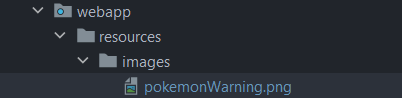

# Basic-Spring-MVC
Spring MVC Demo based on Maven Web application archetype. <br>
Simple project where we configure a resources folder into our web app. 


### Project Structure
We create the /resources/images folder where we placed our .png image.


### spring-mvc-demo-servlet.xml
We then map the folder in our config file.
```
    <!-- Add mapping for resources folder -->
    <mvc:resources mapping="/resources/**" location="/resources/"></mvc:resources>
```
### hello_world.jsp
Now, we display the image using jsp expression language ${pageContext.request.contextPath) and the rest of the directory
```

```
